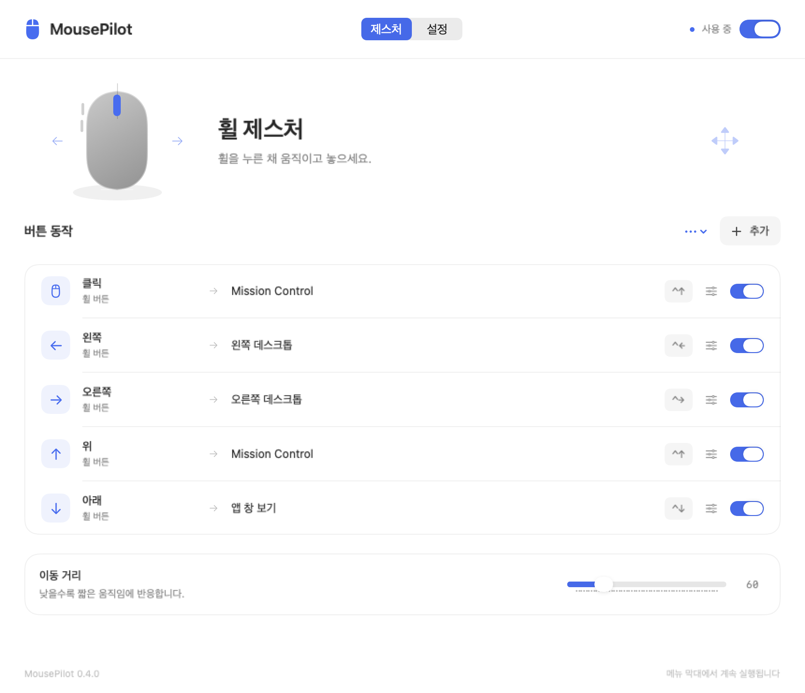
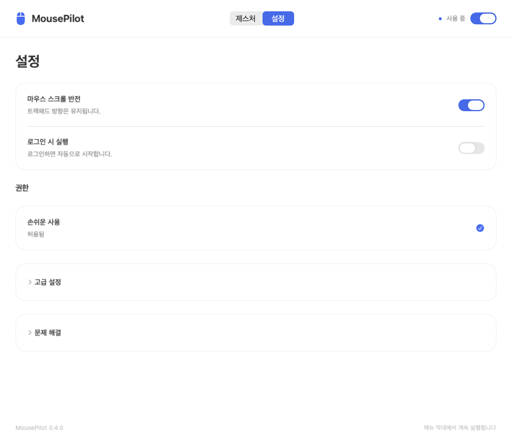

# MousePilot

일반 마우스의 휠 버튼으로 데스크톱을 이동하고 Mission Control을 여는 macOS 앱입니다.
휠을 누른 채 원하는 방향으로 움직이고 놓으면, 지정한 동작을 실행합니다.

**macOS 14 이상 · Swift 6 · SwiftUI · 외부 패키지 의존성 없음**

<picture>
  <source media="(prefers-color-scheme: dark)" srcset="docs/images/gestures-dark.png">
  
</picture>

## 주요 기능

- **휠 버튼 제스처** — 좌우로 데스크톱 이동, 위로 Mission Control, 아래로 앱 창 보기.
- **버튼 동작 설정** — 휠 클릭과 옆면 버튼에 Mac 동작이나 사용자 지정 단축키 연결.
- **마우스 스크롤 반전** — 일반 휠 마우스의 방향만 바꾸고 트랙패드 방향 유지.
- **메뉴 막대에서 실행** — 일시 정지, 로그인 시 실행, 시스템에 맞춘 밝은·어두운 화면.
- **필요할 때만 진단** — 평소에는 입력 기록을 수집하지 않고, 진단용 입력 기록은 직접 켠 동안만 메모리에 유지.

## 기본 동작

| 마우스 입력 | 실행 동작 | 기본 단축키 |
| --- | --- | --- |
| 휠을 누른 채 왼쪽으로 이동 후 놓기 | 왼쪽 데스크톱 | Control + ← |
| 휠을 누른 채 오른쪽으로 이동 후 놓기 | 오른쪽 데스크톱 | Control + → |
| 휠을 누른 채 위로 이동 후 놓기 | Mission Control | Control + ↑ |
| 휠을 누른 채 아래로 이동 후 놓기 | 앱 창 보기 | Control + ↓ |
| 움직이지 않고 휠 클릭 | Mission Control | Control + ↑ |
| 옆면 뒤로·앞으로 버튼 | 기존 동작 유지 | — |

동작은 **버튼을 놓을 때 한 번** 실행됩니다. 작은 손떨림은 클릭으로 처리하고, 설정한 이동 거리에 못 미친 제스처는 취소합니다. 왼쪽·오른쪽 클릭은 매핑하지 않습니다.

## 설치

현재는 소스에서 빌드해 사용합니다. Mac에 Swift 6 이상과 macOS SDK가 포함된 개발 환경이 필요합니다.
저장소를 내려받고 프로젝트 폴더에서 빌드하세요.

```sh
git clone https://github.com/dosbelluno/MousePilot.git
cd MousePilot
swift test
./scripts/build-app.sh
```

빌드 결과:

| 파일 | 용도 |
| --- | --- |
| `build/MousePilot-Gestures.app` | 개발 중 실행할 앱 |
| `build/MousePilot-Gestures.zip` | 설치할 위치로 옮겨 압축을 풀 앱 |

`MousePilot-Gestures.zip`을 **응용 프로그램** 폴더에서 압축 해제하고 앱을 여세요. 기존 앱을 교체할 때는 메뉴 막대에서 먼저 종료합니다.
프로젝트 폴더에서 실행하려면 `./scripts/run.sh`를 사용합니다.

빌드는 사용 가능한 인증서로 서명하며, 인증서가 없으면 로컬용 ad hoc 서명을 사용합니다. 서명 방식과 다른 Mac에 배포하는 방법은 [개발·배포 문서](docs/DEVELOPMENT.md)를 참고하세요.

## 처음 사용하기

1. 앱의 **설정 → 손쉬운 사용 → 허용하기**를 선택합니다.
2. **시스템 설정 → 개인정보 보호 및 보안 → 손쉬운 사용**에서 MousePilot을 허용합니다. macOS가 재실행을 안내하면 앱을 다시 여세요.
3. 앱 상단의 **사용**을 켭니다. 처음 실행할 때는 꺼져 있습니다.
4. 휠을 누른 채 마우스를 움직이고 놓습니다.

데스크톱을 이동하려면 이동할 데스크톱이 있어야 합니다. MousePilot은 해당 동작의 키보드 단축키를 보내므로, macOS에서 **Control + 화살표** 단축키도 활성화되어 있어야 합니다.
다른 단축키를 사용 중이라면 동작 편집에서 실제 단축키를 지정하세요.

마우스 매핑에는 **손쉬운 사용** 권한을 사용합니다. **입력 모니터링**은 필수 권한이 아닙니다.
창을 닫아도 앱은 메뉴 막대에서 계속 실행됩니다.

## 원하는 대로 바꾸기

**제스처** 화면에서 동작 옆의 편집 버튼을 누르면 마우스 버튼, 이동 방향, 보조 키, 실행할 동작을 바꿀 수 있습니다.
Mission Control, 데스크톱 이동, 앱 창 보기, 이전 앱, Spotlight 등에서 선택하거나 단축키를 직접 기록하세요.
**이동 거리**를 낮추면 짧은 움직임에도 제스처가 인식됩니다.

**설정 → 마우스 스크롤 반전**을 켜면 일반 휠 마우스의 세로·가로 스크롤 방향을 뒤집습니다.
macOS의 자연스러운 스크롤 설정과 트랙패드 방향은 유지됩니다. **사용**을 끄면 제스처와 스크롤 반전이 함께 일시 정지됩니다.

<details>
<summary>설정 화면 보기</summary>

<picture>
  <source media="(prefers-color-scheme: dark)" srcset="docs/images/settings-dark.png">
  
</picture>

</details>

## 개인정보와 저장

앱은 네트워크를 사용하지 않습니다. 키보드 입력 내용과 마우스 이동 경로를 저장하지 않으며, 평소에는 버튼·제스처 입력 기록도 만들지 않습니다.

- 설정은 `~/Library/Application Support/MousePilot/settings.json`에 저장합니다.
- 단축키 기록은 동작 편집에서 기록 영역을 선택한 동안만 작동합니다.
- **설정 → 문제 해결 → 진단용 입력 기록**을 켜면 최근 입력을 최대 40개까지 메모리에 보관합니다. 파일에 저장하지 않으며, 끄면 즉시 삭제됩니다. 앱을 다시 열면 기록은 꺼진 상태로 시작합니다.
- 기존 설정을 새 형식으로 옮기거나 손상된 설정을 발견하면, 같은 폴더에 원본을 백업합니다.

## 동작하지 않을 때

**제스처는 인식되지만 동작하지 않는 경우**, 먼저 키보드의 Control + ↑ 또는 Control + ←/→가 동작하는지 확인하세요. 시스템 단축키가 다르면 MousePilot의 매핑도 맞춰야 합니다.

**권한을 허용했는데 연결되지 않는 경우**, 앱을 종료하고 손쉬운 사용 목록에서 기존 항목을 제거한 뒤 현재 앱을 다시 추가하세요. 재빌드로 서명이 바뀌었을 때 권한을 다시 등록해야 할 수 있습니다.

**설정 → 문제 해결 → 진단 정보 → 복사**에서 권한과 연결 상태를 확인할 수 있습니다.

## 지원 범위

- 표준 휠 클릭이나 추가 버튼 신호를 보내는 일반 마우스를 대상으로 합니다. 제조사 전용 DPI 버튼 등은 감지하지 못할 수 있습니다.
- 연결된 모든 마우스에 공통 설정을 적용합니다. 장치별·앱별 프로필과 Windows는 지원하지 않습니다.
- 스크롤 반전은 일반 하드웨어 휠 입력에 적용합니다. Magic Mouse, 트랙패드, 다른 프로그램이 부드러운 스크롤로 변환한 입력은 변경하지 않습니다.
- 제스처로 사용하는 버튼의 원래 클릭·드래그 동작은 해당 매핑이 활성화된 동안 대체됩니다.

## 개발

자동 테스트는 제스처 판정, 설정 저장·이전, 키 이벤트 생성, 스크롤 반전, 진단 기록을 검사합니다.
테스트와 빌드는 앱을 실행하거나 시스템에 마우스·키보드 입력을 보내지 않습니다.

[개발·배포 문서](docs/DEVELOPMENT.md) · [변경 기록](CHANGELOG.md)

## 라이선스

라이선스는 아직 지정하지 않았습니다.
